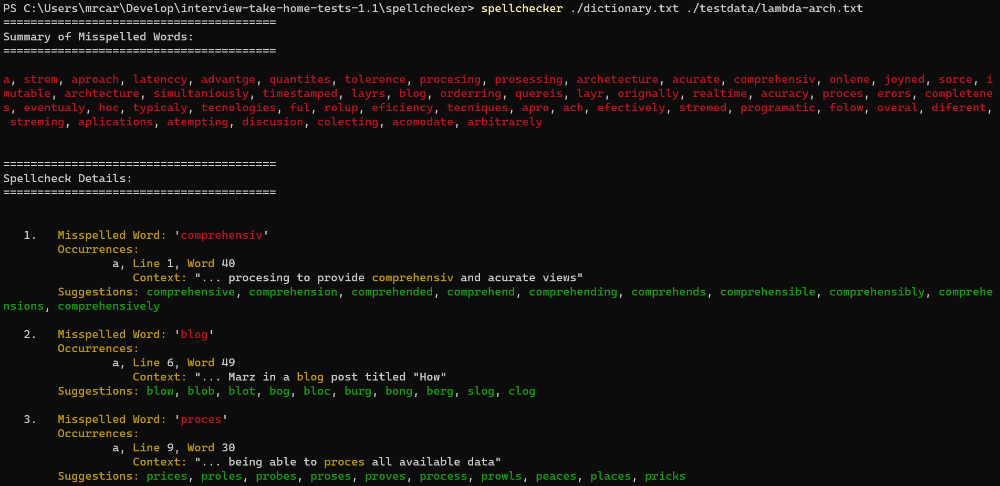

# Spellchecker



## Overview

This is a simple spellchecker written as a terminal program in Golang. This project demonstrates my ability to write a basic spellchecking application. When looping through the words this program uses goroutines to speed up the process by using multiple threads. There are mutex locks that prevent the same word from being processed at the same time. 

The algorithm chosen for this application uses a hashmap to find exact matches on words. If an exact match is not found then it will use the Damerau-Levenshtein distance algorithm to find matches that are within a certain edit distance. It then will use a calculated rank based on the first and last letter of the word matching and the length of the word to determine the best matches. The application trims the suggested words down to ten.

## Design Considerations

I chose to use Golang because it is a language that I enjoy working with. It is fast and provides multi-threading as a basic feature. I took advantage of this by using goroutine to allow multiple words to be processed at the same time. To prevent overloading the number of threads in use I set a max number of threads to 10. This can be easily modified in the config file.

In my research I identified and chose to use the [Damerau-Levenshtein distance algorithm](https://en.wikipedia.org/wiki/Damerau%E2%80%93Levenshtein_distance). I implemented this algorithm and also created a hash map for the dictionary that would easily find exact matches and continue on to the next word to prevent unnecessary word on valid words. I was getting a lot of results that were not super relevant even with that algorithm. I decided to add a ranking function to allow me to apply a rank to each word. This effectively brought the most relevent suggestions to the top after sorting the slice/array. Another to note is that the entire dictionary is loaded into memory in the application which may not be ideal for extremely larger dictionaries.

I found it necessary to clean up contractions and words with dashes, slashes, and apostrophes. There were a few different methods of clean up from removing special characters like commas and perods to splitting up contractions and separating the words with dashes and slashes. I am also removing plural and possessive endings from words to better match words in the dictionary. There is more that could be done to improve the algorithm though I felt that my work has been sufficient for this project. Such as using a Tree structure tor Trie could be used to improve the speed of spellchecking.

I packaged the terminal output into an easy to read format that provides a list of all misspelled words. I included the details for each word which included the occurrences. Each occurrence lists the line and word number along with the context of the word using the previous and next three words. I sought to simplify the application by breaking out functions into separate files making it easier to maintain and test.

This was a fun project to work on and I learned a lot more about the complexities regarding spellchecking.

## Installation

Ensure that you have [Golang](https://golang.org/doc/install) installed on your machine.

To install the spellchecker run the following command in your terminal.

```bash
cd /directory/to/spellchecker
go install ./cmd/spellchecker
```

## Usage

After installing the spellchecker you can run it using the following command with the `<file to check>` and `<dictionary>` arguments. 

```bash
spellchecker <file-to-check> <dictionary>
```

### Arguments

- `<file-to-check>` - The path to the txt file that you want to spell check.
- `<dictionary>` - The path to the dictionary txt file that you want to use to check the spelling of the file.


### Example

```bash
spellchecker ./testdata/incorrect-spelling.txt ./test/dictionary.txt
```

## Testing

This Application includes unit and integration tests that verify the functionality that has been implemented.

To run the tests use the following command.

```bash
go test ./...
```

## Assumptions

- This application is primarily written for the English language using ASCII characters.
- Unicode characters used by other languages will not be properly checked.

## Structure

The application is structured as follows:

```
spellchecker
├── cmd
│   └── spellchecker
│       └── the main entry point for the app (spellchecker.go)
├── config
│   └── central configuration (config.go)
├── internal
│   ├── dictionary
│   │   ├── dictionary processing (dictionary.go)
│   │   └── unit tests for dictionary (dictionary_test.go)
│   ├── stringutils
│   │   ├── utility functions for string manipulation (dalev distance algo) (stringutils.go)
│   │   └── unit tests for string utilities (stringutils_test.go)
│   └── textprocessing
│       ├── text processing and cleanup (textprocessing.go)
│       └── unit tests for text processing (textprocessing_test.go)
├── pkg
│   └── spellcheck
│       ├── core spellchecking logic (spellcheck.go, spellchecker.go)
│       ├── result presentation (result_printer.go)
│       └── unit tests for spellchecking components
├── testdata
│   └── sample files for testing and demonstration
├── dictionary.txt
│   └── sample dictionary file
```

### Key Components

- **cmd/spellchecker**: Contains the main entry point of the application. This is where the spellchecking process is initiated.
- **config**: Stores the global configuration settings which centralizes parameters used while running the spellcheck.
- **internal/dictionary**: Handles opening the dictionary file and returning a map and slice of the dictionary words.
- **internal/stringutils and textprocessing**: Utilities for string manipulation and text processing used to clean and preparing text data for spellchecking. Handles words with dashes, slashes, and apostrophes also built to work with contraction like can't, don't, and won't.
- **pkg/spellcheck**: The spellchecking file is opened at this point. The primary functions for looping through the words is included here. It also includes the components that generate output in the terminal to present the results.
- **testdata**: Contains sample text files for testing the spellchecker.
- **dictionary.txt**: The dictionary file provided for this task.